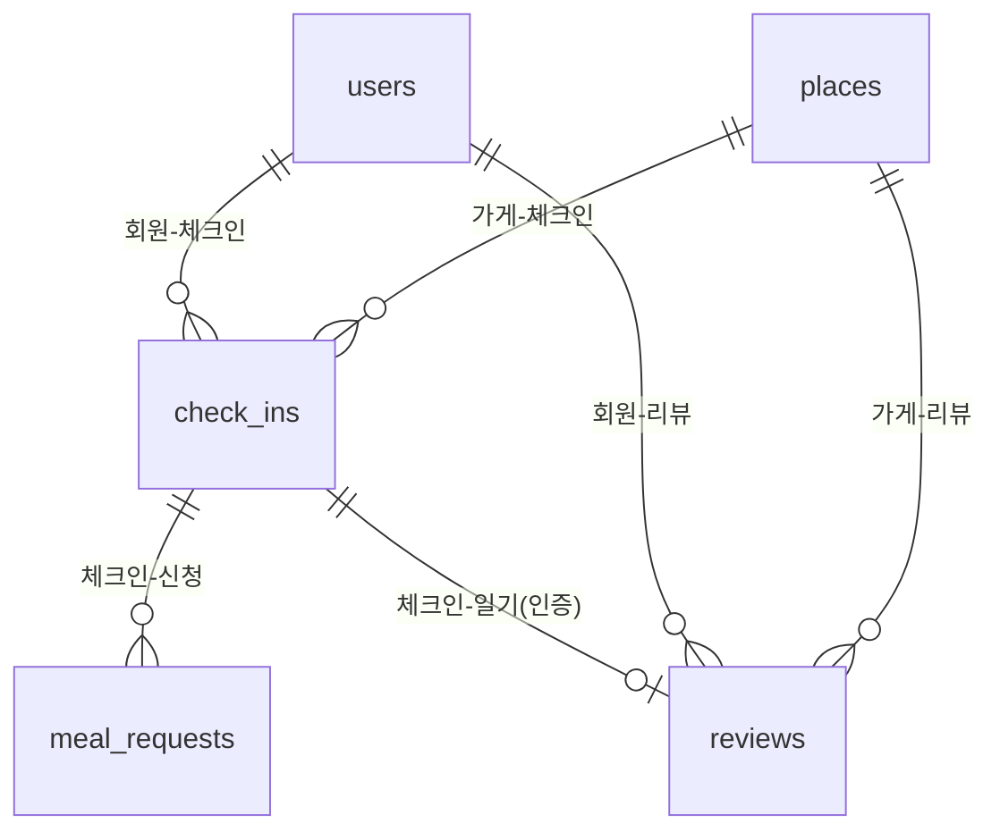
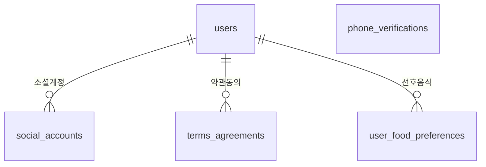
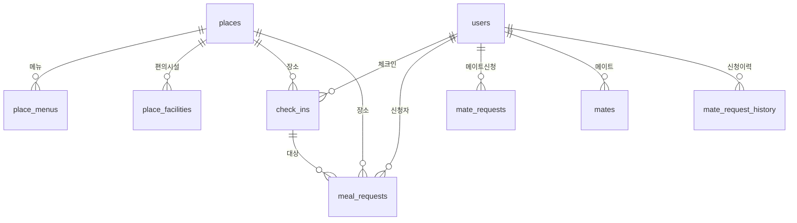
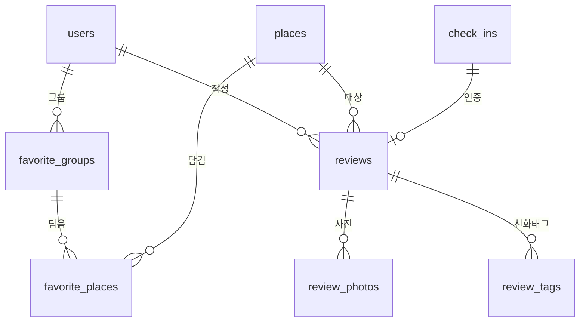
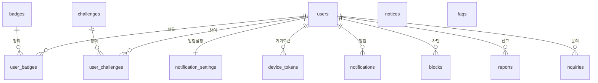

# 🗄️ ERD 간단 정리 (한글 병기) — 혼정

> 빠르게 보는 **요약본**입니다. 제약·인덱스·집계쿼리 등 상세는 [`04-ERD-데이터모델.md`](./04-ERD-데이터모델.md) 참고.
> 표기: PK=기본키, FK=외래키, UK=유니크. 타입은 길이 생략(간단표기).

---

## 📋 한눈에 보기 (10그룹 · 30테이블)

| 그룹 | 테이블 | 한글명 | 한 줄 설명 |
| --- | --- | --- | --- |
| A 인증·계정 | `users` | 회원 | 사용자 기본·프로필 |
| | `social_accounts` | 소셜 계정 | 카카오/애플 로그인 매핑 |
| | `phone_verifications` | 휴대폰 인증 | 인증번호 발송·확인 |
| | `terms_agreements` | 약관 동의 | 약관별 동의 기록 |
| | `user_food_preferences` | 선호 음식 | 회원이 고른 음식(최대 3) |
| B 장소 | `places` | 장소(가게) | 공공데이터 식당 마스터(전국 일괄 적재) |
| | `place_menus` | 가게 메뉴 | 메뉴·가격·사진 |
| | `place_facilities` | 가게 편의시설 | 바테이블·1인석 등 |
| C 체크인·연결 | `check_ins` | 혼밥 체크인 | "지금 혼밥 중"(핵심) |
| | `meal_requests` | 같이먹기 신청 | 인사말 포함 신청 |
| D 메이트 | `mate_requests` | 메이트 신청 | 메이트 추가 요청(진행 중) |
| | `mates` | 메이트 관계 | 맺어진 메이트 |
| | `mate_request_history` | 메이트 신청 이력 | 종료된 신청 기록(재신청·이력) |
| E 즐겨찾기 | `favorite_groups` | 즐겨찾기 그룹 | 그룹(공개설정) |
| | `favorite_places` | 즐겨찾기 식당 | 그룹에 담은 식당 |
| F 리뷰·혼밥일기 | `reviews` | 리뷰=혼밥일기 | 리뷰 겸 개인 방문기록(별점2종) |
| | `review_photos` | 리뷰 사진 | 첨부 사진(식당 갤러리 출처) |
| | `review_tags` | 친화태그 | 혼밥친화도 집계 원천 |
| H 성취 | `badges` | 뱃지(정의) | 뱃지 마스터 |
| | `user_badges` | 사용자 뱃지 | 획득한 뱃지 |
| | `challenges` | 챌린지(정의) | 챌린지 마스터 |
| | `user_challenges` | 사용자 챌린지 | 참여·진행률 |
| I 알림 | `notification_settings` | 알림 설정 | 카테고리·방해금지 |
| | `device_tokens` | 기기 토큰 | 푸시 토큰 |
| | `notifications` | 알림함 | 인앱 알림 |
| J 안전 | `blocks` | 차단 | 차단 목록 |
| | `reports` | 신고 | 신고 접수 |
| K 운영 | `notices` | 공지사항 | 관리자 공지 |
| | `faqs` | 자주 묻는 질문 | FAQ |
| | `inquiries` | 1:1 문의 | 고객 문의 |

---

## 🔗 핵심 관계 (간단)

> 거의 모든 데이터는 **회원(users)** 과 **가게(places)** 에 매달립니다.

---

## 🗺️ 전체 관계도 (그룹별 4장)

> 30개를 한 장에 넣으면 너무 작아져서 **그룹별 4장**으로 나눴습니다. 네 그림은 **`users`(회원)·`places`(가게)** 두 허브로 서로 이어집니다.

### ① 인증·계정

> `phone_verifications`(가입 전 인증)는 회원과 외래키로 안 묶여 따로 떨어져 있습니다.

### ② 장소·체크인·연결

### ③ 즐겨찾기·리뷰·혼밥일기

### ④ 성취·알림·안전·운영

> `notices`·`faqs`(관리자 콘텐츠)는 외래키가 없어 따로 떨어져 있습니다.

---

## A. 인증·계정

### `users` — 회원
| 컬럼 | 한글명 | 타입 | 설명 |
| --- | --- | --- | --- |
| id | 식별자 | bigint | PK |
| phone | 휴대폰 | varchar | 1차 식별자 · UK |
| email | 이메일 | varchar | OAuth 제공(선택) |
| nickname | 닉네임 | varchar | 표시 이름 · UK |
| profile_image_url | 프로필 사진 | varchar | 이미지 URL |
| gender | 성별 | varchar | MALE/FEMALE/NONE |
| age_group | 연령대 | varchar | 20s 등 |
| introduction | 한 줄 소개 | varchar | |
| region | 동네 | varchar | 시군구·동 |
| region_lat / region_lng | 동네 좌표 | double | 위도/경도 |
| dining_style | 식사 성향 | varchar | TALK/QUIET |
| allow_meal_request | 같이먹기 허용 | bool | 수신 여부 |
| status | 상태 (신고, 차단, 탈퇴 등등)| varchar | ACTIVE/SUSPENDED/WITHDRAWN |
| created_at / updated_at | 생성/수정 시각 | timestamp | |

### `social_accounts` — 소셜 계정(로그인 연동)
| 컬럼 | 한글명 | 타입 | 설명 |
| --- | --- | --- | --- |
| id | 식별자 | bigint | PK |
| user_id | 회원 | bigint | FK→users |
| provider | 공급자 | varchar | KAKAO/APPLE |
| provider_user_id | 공급자측 ID | varchar | 공급자 고유 sub · UK(provider+이값) |
| email | 이메일 | varchar | 공급자 제공(선택) |
| created_at / updated_at | 생성/수정 시각 | timestamp | |

> 공급자 토큰은 저장 안 함(로그인 식별만). 성공 시 우리 자체 JWT 발급.

### `phone_verifications` — 휴대폰 인증
| 컬럼 | 한글명 | 타입 | 설명 |
| --- | --- | --- | --- |
| id | 식별자 | bigint | PK |
| phone | 휴대폰 | varchar | 대상 번호 |
| code | 인증번호 | varchar | 발송 코드 |
| expires_at | 만료 시각 | timestamp | 예: 3분 |
| verified | 확인됨 | bool | 성공 여부 |
| attempts | 시도 횟수 | int | 초과 차단 |
| created_at | 발송 시각 | timestamp | |

### `terms_agreements` — 약관 동의
| 컬럼 | 한글명 | 타입 | 설명 |
| --- | --- | --- | --- |
| id | 식별자 | bigint | PK |
| user_id | 회원 | bigint | FK→users · UK(1인 1행) |
| service | 서비스 약관 | bool | (필수) |
| privacy | 개인정보 | bool | (필수) |
| location | 위치기반 | bool | (필수) |
| marketing | 마케팅 수신 | bool | (선택) |
| agreed_at | 동의 시각 | timestamp | |

### `user_food_preferences` — 선호 음식
| 컬럼 | 한글명 | 타입 | 설명 |
| --- | --- | --- | --- |
| id | 식별자 | bigint | PK |
| user_id | 회원 | bigint | FK→users · UK(1인 1행) |
| food1 | 선호 음식 1 | varchar | null 허용 |
| food2 | 선호 음식 2 | varchar | null 허용 |
| food3 | 선호 음식 3 | varchar | null 허용 |

---

## B. 장소

### `places` — 장소(가게) · **공공데이터 마스터**
| 컬럼 | 한글명 | 타입 | 설명 |
| --- | --- | --- | --- |
| id | 식별자 | bigint | PK · **시스템 식당 식별자**(FK 대상) |
| source | 출처 | varchar | `PUBLIC_DATA`(현재) / 향후 `MANUAL` 등 |
| source_id | 출처 ID | varchar | 공공데이터 관리번호 · 멱등 적재 키 · UK(source+source_id) |
| name | 가게명 | varchar | 사업장명 |
| category | 카테고리 | varchar | 업태(한식/중식/일식…) |
| address | 지번주소 | varchar | |
| road_address | 도로명주소 | varchar | |
| latitude / longitude | 좌표 | double | **WGS84**(공공데이터 EPSG:5174→변환) |
| phone | 전화 | varchar | 공공데이터 제공 |
| business_status | 영업상태 | varchar | 영업/폐업 — 노출필터·동기화용 |
| homepage_url | 홈페이지 | varchar | (P2 — 공공/카카오 미제공) |
| business_hours | 영업시간 | jsonb | (P2 — 미제공) |
| created_at / updated_at | 생성/수정 시각 | timestamp | |

> **출처 = 공공데이터(전국일반음식점표준데이터, 약 213만 건)를 일괄 적재한 마스터.** 카카오 로컬 데이터는 약관상 장기 저장 불가(운영정책 제20조)라 식당 데이터 출처로 쓰지 않으며, **카카오는 앱의 지도 렌더링 SDK 용도로만** 사용한다. 기존 `external_id`(카카오 ID) 컬럼은 제거. 좌표는 EPSG:5174→WGS84 변환 후 저장(towgs84 7파라미터 필수). 검색·주변검색·체크인은 이 마스터(`places.id`)를 기준으로 동작한다. (상세: [식당데이터 전략](./07-식당데이터-전략.md))

### `place_menus` — 가게 메뉴
| 컬럼 | 한글명 | 타입 | 설명 |
| --- | --- | --- | --- |
| id | 식별자 | bigint | PK |
| place_id | 가게 | bigint | FK→places |
| name | 메뉴명 | varchar | |
| price | 가격 | int | 원 |
| image_url | 메뉴 사진 | varchar | |
| source | 출처 | varchar | UGC/ADMIN/API |
| created_by_user_id | 작성자 | bigint | FK→users |
| created_at | 생성 시각 | timestamp | |

### `place_facilities` — 가게 편의시설
| 컬럼 | 한글명 | 타입 | 설명 |
| --- | --- | --- | --- |
| id | 식별자 | bigint | PK |
| place_id | 가게 | bigint | FK→places · UK(가게당 1행) |
| bar_seat | 바테이블 | bool | |
| single_seat | 1인석 | bool | |
| wifi | 와이파이 | bool | |
| outlet | 콘센트 | bool | |
| solo_ok | 혼밥 환영 | bool | |
| long_stay | 오래 머무르기 | bool | |
| updated_at | 수정 시각 | timestamp | |

> 시설별 boolean 컬럼(가게당 1행). 공공데이터·카카오 모두 미제공이라 **점주 직접 등록(가장 안전, P2) / 관리자 입력 / UGC**로 채운다(크롤은 법적 리스크). 공공데이터 마스터(`places`)가 그 부착 토대. 시설 종류 추가 시 컬럼 추가(마이그레이션).

> **가게 사진은 별도 테이블 없음** — 식당 상세 사진 탭/`GET /api/places/{placeId}/photos`는 `review_photos`를 `place_id`로 집계해(`reviews` JOIN) 노출한다(출처 = 리뷰 UGC). 카카오 미제공·관리자 큐레이션 부재로 `place_photos`는 두지 않음(필요 시 추후 추가). 메뉴 사진은 `place_menus.image_url`로 별도 유지.

---

## C. 체크인·연결

### `check_ins` — 혼밥 체크인 (핵심)
| 컬럼 | 한글명 | 타입 | 설명 |
| --- | --- | --- | --- |
| id | 식별자 | bigint | PK |
| user_id | 회원 | bigint | FK→users |
| place_id | 가게 | bigint | FK→places |
| status | 상태 | varchar | ACTIVE/ENDED |
| started_at | 시작 시각 | timestamp | 토글 ON |
| ended_at | 종료 시각 | timestamp | 토글 OFF/만료 |
| created_at | 생성 시각 | timestamp | |

> 한 회원당 ACTIVE 1개만 — **부분 유니크 인덱스**(`user_id` WHERE status='ACTIVE')로 강제, 과거 ENDED는 무제한 누적.
> 화면-서버 어긋남 대비: 진입 시 `GET /check-ins/me`로 동기화 → 신규 체크인이 409면 기존 종료 후 재시도, 같은 장소는 멱등, 방치된 ACTIVE는 자동 만료. (상세는 [데이터모델 §C-1](./04-ERD-데이터모델.md))

### `meal_requests` — 같이먹기 신청
| 컬럼 | 한글명 | 타입 | 설명 |
| --- | --- | --- | --- |
| id | 식별자 | bigint | PK |
| from_user_id | 신청자 | bigint | FK→users |
| to_check_in_id | 대상 체크인 | bigint | FK→check_ins |
| place_id | 가게 | bigint | FK→places |
| message | 인사말 | varchar | 한마디 |
| status | 상태 | varchar | PENDING/ACCEPTED/DECLINED |
| created_at | 신청 시각 | timestamp | |
| responded_at | 응답 시각 | timestamp | |

> **반응(`reactions`)은 보류** — "나도 여기/같이 먹는 중"(FR-106) 초간단 반응 기능은 이번 범위에서 제외하고 추후 추가한다. 핵심 연결은 `meal_requests`(같이먹기 신청)만으로 진행. 추가 시 `check_ins`에 매다는 별도 테이블로 복원.

---

## D. 메이트

### `mate_requests` — 메이트 신청
| 컬럼 | 한글명 | 타입 | 설명 |
| --- | --- | --- | --- |
| id | 식별자 | bigint | PK |
| from_user_id | 신청자 | bigint | FK→users |
| to_user_id | 대상 | bigint | FK→users |
| status | 상태 | varchar | PENDING/ACCEPTED/DECLINED |
| created_at / responded_at | 신청/응답 시각 | timestamp | UK(신청자+대상) |

> **진행 중(PENDING) 신청만 보관.** 수락 시 `mates` 생성, 수락·거절·취소로 끝나면 `mate_request_history`로 옮기고 행 삭제 → 거절·해제 후 재신청 가능.

### `mates` — 메이트 관계
| 컬럼 | 한글명 | 타입 | 설명 |
| --- | --- | --- | --- |
| id | 식별자 | bigint | PK |
| user_id | 회원 | bigint | FK→users |
| mate_user_id | 메이트 | bigint | FK→users · UK(회원+메이트) |
| created_at | 맺은 시각 | timestamp | 양방향 2행 |

### `mate_request_history` — 메이트 신청 이력
| 컬럼 | 한글명 | 타입 | 설명 |
| --- | --- | --- | --- |
| id | 식별자 | bigint | PK |
| from_user_id | 신청자 | bigint | FK→users |
| to_user_id | 대상 | bigint | FK→users |
| result | 결과 | varchar | ACCEPTED/DECLINED/CANCELED |
| requested_at / resolved_at | 신청/처리 시각 | timestamp | 유니크 없음(다중 이력) |

> 종료된 신청 이력(append-only). `mate_requests`에서 이관. 과거 이력은 여기서 조회.

---

## E. 즐겨찾기

### `favorite_groups` — 즐겨찾기 그룹
| 컬럼 | 한글명 | 타입 | 설명 |
| --- | --- | --- | --- |
| id | 식별자 | bigint | PK |
| user_id | 회원 | bigint | FK→users |
| name | 그룹명 | varchar | |
| icon | 아이콘 | varchar | 이모지 |
| description | 설명 | varchar | |
| is_public | 공개 여부 | bool | |
| created_at | 생성 시각 | timestamp | |

### `favorite_places` — 즐겨찾기 식당
| 컬럼 | 한글명 | 타입 | 설명 |
| --- | --- | --- | --- |
| id | 식별자 | bigint | PK |
| group_id | 그룹 | bigint | FK→favorite_groups |
| place_id | 가게 | bigint | FK→places · UK(그룹+가게) |
| visited | 다녀옴 | bool | |
| created_at | 생성 시각 | timestamp | |

---

## F. 리뷰 · 혼밥일기

### `reviews` — 리뷰 = 혼밥일기 (통합)
| 컬럼 | 한글명 | 타입 | 설명 |
| --- | --- | --- | --- |
| id | 식별자 | bigint | PK |
| user_id | 작성자 | bigint | FK→users |
| check_in_id | 체크인 | bigint | FK→check_ins(선택·인증) |
| place_id | 가게 | bigint | FK→places (다회 허용, UK 없음) |
| visited_at | 방문 시각 | timestamp | |
| mood | 기분 | varchar | |
| content | 본문 | text | 후기=일기 |
| taste_rating | 맛 별점 | smallint | 1~5 |
| solo_friendly_rating | 혼밥친화 별점 | smallint | 1~5(집계 원천) |
| created_at / updated_at | 생성/수정 시각 | timestamp | |

> 리뷰 작성 = 혼밥일기 작성(한 번에, 공개). 좋아요·댓글 없음. 방문마다 1건(같은 식당 여러 번 가능).

### `review_photos` / `review_tags` — 리뷰 사진/친화태그
| 테이블 | 컬럼 | 한글 | 설명 |
| --- | --- | --- | --- |
| review_photos | id · review_id · image_url · sort_order | 식별자·리뷰·사진·순서 | FK→reviews (식당 갤러리 출처) |
| review_tags | id · review_id · place_id · tag | 식별자·리뷰·가게·태그 | 식당별 친화도 집계(place_id 역정규화) |

---

## H. 성취

### `badges` / `user_badges` — 뱃지(정의)/사용자 뱃지
| 테이블 | 컬럼 | 한글 | 설명 |
| --- | --- | --- | --- |
| badges | id · code · name · emoji · description · condition_type · condition_value | 식별자·코드·이름·이모지·설명·조건종류·조건값 | 마스터 |
| user_badges | id · user_id · badge_id · achieved_at | 식별자·회원·뱃지·획득시각 | UK(회원+뱃지) |

### `challenges` / `user_challenges` — 챌린지(정의)/사용자 챌린지
| 테이블 | 컬럼 | 한글 | 설명 |
| --- | --- | --- | --- |
| challenges | id · title · period · condition_type · target · starts_at · ends_at · active | 식별자·제목·주기·조건종류·목표·시작·종료·활성 | 마스터 |
| user_challenges | id · user_id · challenge_id · progress · completed · completed_at | 식별자·회원·챌린지·진행률·완료·완료시각 | UK(회원+챌린지) |

---

## I. 알림

### `notification_settings` — 알림 설정
| 컬럼 | 한글명 | 타입 | 설명 |
| --- | --- | --- | --- |
| id | 식별자 | bigint | PK |
| user_id | 회원 | bigint | FK→users · UK(회원당 1행) |
| master_enabled | 전체 알림 | bool | |
| activity_enabled | 활동 알림 | bool | 같이먹기/리뷰/챌린지 |
| mate_enabled | 메이트 알림 | bool | 신청/혼밥시작 |
| marketing_enabled | 마케팅 알림 | bool | 이벤트/공지 |
| dnd_start / dnd_end | 방해금지 시작/끝 | time | |
| updated_at | 수정 시각 | timestamp | |

### `device_tokens` / `notifications` — 기기 토큰/알림함
| 테이블 | 컬럼 | 한글 | 설명 |
| --- | --- | --- | --- |
| device_tokens | id · user_id · token · platform | 식별자·회원·토큰·플랫폼 | UK(token), IOS/ANDROID/EXPO |
| notifications | id · user_id · type · title · body · payload · read | 식별자·회원·종류·제목·본문·데이터·읽음 | 인앱 알림함 |

---

## J. 안전

### `blocks` / `reports` — 차단/신고
| 테이블 | 컬럼 | 한글 | 설명 |
| --- | --- | --- | --- |
| blocks | id · user_id · blocked_user_id | 식별자·회원·차단대상 | UK(회원+대상) |
| reports | id · reporter_id · target_type · target_id · reason · status | 식별자·신고자·대상종류·대상ID·사유·상태 | USER/REVIEW/CHECKIN/COMMENT |

---

## K. 운영

### `notices` / `faqs` / `inquiries` — 공지/FAQ/문의
| 테이블 | 컬럼 | 한글 | 설명 |
| --- | --- | --- | --- |
| notices | id · category · title · body · pinned · published_at | 식별자·분류·제목·본문·상단고정·게시일 | UPDATE/EVENT/INFO |
| faqs | id · category · question · answer · sort_order | 식별자·분류·질문·답변·순서 | |
| inquiries | id · user_id · category · content · status · answer · answered_at | 식별자·회원·분류·내용·상태·답변·답변시각 | OPEN/ANSWERED/CLOSED |

---

## 🔤 상태값 모음 (ENUM)

| 컬럼 | 값 |
| --- | --- |
| users.status | ACTIVE / SUSPENDED / WITHDRAWN |
| users.gender | MALE / FEMALE / NONE |
| users.dining_style | TALK / QUIET |
| social_accounts.provider | KAKAO / APPLE |
| place_menus.source | UGC / ADMIN / API |
| check_ins.status | ACTIVE / ENDED |
| meal_requests·mate_requests.status | PENDING / ACCEPTED / DECLINED |
| mate_request_history.result | ACCEPTED / DECLINED / CANCELED |
| challenges.period | WEEKLY / MONTHLY |
| device_tokens.platform | IOS / ANDROID / EXPO |
| reports.target_type | USER / REVIEW / CHECKIN / COMMENT |
| reports.status | PENDING / REVIEWED / RESOLVED |
| notices.category | UPDATE / EVENT / INFO |
| inquiries.status | OPEN / ANSWERED / CLOSED |
