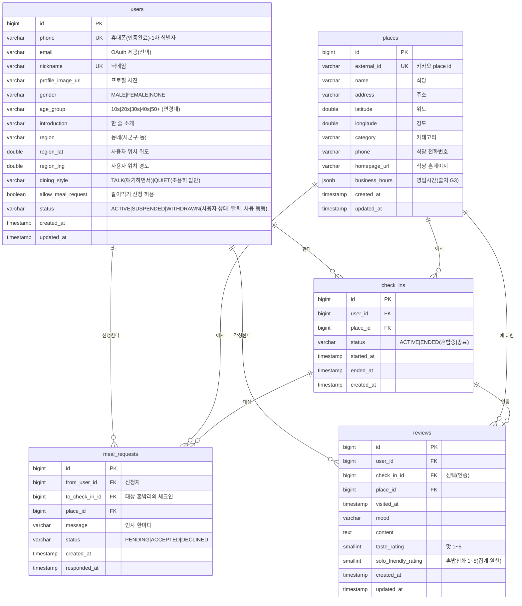

# 🗄️ ERD & 데이터 모델 — 혼정 (혼밥을 정상화하다)

> 2단계(설계) 문서 — **v2 (전체 확장본)**. MVP 6개 테이블에 더해, `06-화면별-기능요구사항`이 흡수한 22개 화면(P1~P3)을 데이터 모델로 정식화한다.
> 외부 카카오 API 가게 정보는 `places`에 **캐싱**하고, 체크인·리뷰·일기·메이트 등 UGC는 우리 DB가 소유한다.
> **단계 태그**: P1(MVP·핵심) / P2(경험 강화) / P3(콘텐츠·운영). 구현은 단계순으로 마이그레이션을 분리한다(§6).

---

## 0. v1(MVP) 대비 변경 요약

| # | 변경 | 사유 |
| --- | --- | --- |
| C1 | **인증 모델 교체** — `users.password_hash` 제거, `email` nullable화, **`phone`을 1차 식별자(UNIQUE)** 로. `social_accounts`·`phone_verifications`·`terms_agreements` 신규 | 06 §1.1: OAuth(카카오/애플)+휴대폰 인증으로 전환(이메일/비번 폐기) |
| C2 | **`users` 프로필 확장** — profile_image_url·gender·age_group·introduction·region(+lat/lng)·dining_style·nickname UNIQUE | 06 A-4 ProfileSetup, FR-003E |
| C9 | **`level` 컬럼 제거** — 레벨/뱃지(FR-202)는 추후 도입 시 재설계 | 사용자 결정(레벨 보류) |
| C3 | **리뷰 = 혼밥일기 통합** — 한 번 작성으로 공개 리뷰 겸 개인 방문기록. `reviews` 단일 테이블(`dining_logs` 흡수): `check_in_id`(인증)·`visited_at`·`mood`·`solo_friendly_rating`(별점 2종)·`review_tags`(친화태그). 좋아요·댓글(`review_likes`/`review_comments`) 제거 | 사용자 결정(F+G 통합) |
| C4 | **혼밥 친화도 점수의 원천 정의** — 식당 상세의 "혼밥 친화도"는 `reviews.solo_friendly_rating` + `review_tags` 집계로 산출 | 06 C-1, FR-105E |
| C5 | **`meal_requests.message`(인사말) 추가** | 06 D-1 MealRequest |
| C6 | **소셜/콘텐츠 도메인 신규** — 메이트·즐겨찾기·성취(뱃지/챌린지)·알림·차단/신고·운영(공지/FAQ/문의) | 06 §3 전체 |
| C7 | **장소 상세 확장** — `place_menus`·`place_facilities` + `places`에 phone·homepage·business_hours. **메뉴 출처(UGC/ADMIN/API)는 `source` 컬럼으로 흡수**. **식당 사진은 별도 테이블 없이 `review_photos` 집계로 대체**(G3 결정: 리뷰 UGC를 사진 출처로 확정) | 06 G3, FR-105E |
| C8 | **단일 활성 체크인 불변식** — `check_ins`에 부분 유니크(사용자당 ACTIVE 1개) | 06 §1.6, 05 §5(409 정책) |
| C10 | **메이트 신청 이력 분리** — `mate_requests`는 진행 중(PENDING)만 보관, 종료(수락/거절/취소)는 `mate_request_history` 신규 테이블로 이관. 거절·해제 후 재신청 충돌 해소 + 과거 이력 조회 | 사용자 결정(D 파트) |

> 전체 **10개 도메인 · 30개 테이블**. 핵심 경로(체크인·통계·연결)는 v1과 동일하여 하위 호환된다.

---

## 1. ERD (관계 다이어그램)

### 1.1 핵심 도메인 (체크인 데이터 hot-path)



### 1.2 전체 엔티티 관계 맵 (도메인 그룹)

```mermaid
erDiagram
    %% A. 인증·계정
    users ||--o{ social_accounts      : "연결"
    users ||--o{ phone_verifications  : "인증요청"
    users ||--o{ terms_agreements     : "동의"
    users ||--o{ user_food_preferences: "선호"

    %% B. 장소 상세
    places ||--o{ place_menus      : "메뉴"
    places ||--o{ place_facilities : "편의시설"

    %% D. 메이트
    users ||--o{ mate_requests : "신청"
    users ||--o{ mates         : "맺는다"
    users ||--o{ mate_request_history : "신청이력"

    %% E. 즐겨찾기
    users           ||--o{ favorite_groups : "소유"
    favorite_groups ||--o{ favorite_places : "담는다"
    places          ||--o{ favorite_places : "담김"

    %% F. 리뷰·혼밥일기(통합)
    reviews ||--o{ review_photos : "사진"
    reviews ||--o{ review_tags   : "친화태그"
    places  ||--o{ review_tags   : "식당집계(place_id)"

    %% H. 성취
    users      ||--o{ user_badges     : "획득"
    badges     ||--o{ user_badges     : "정의"
    users      ||--o{ user_challenges : "참여"
    challenges ||--o{ user_challenges : "정의"

    %% I. 알림
    users ||--|| notification_settings : "설정"
    users ||--o{ device_tokens         : "기기"
    users ||--o{ notifications         : "수신"

    %% J. 안전
    users ||--o{ blocks  : "차단"
    users ||--o{ reports : "신고"

    %% K. 운영
    users ||--o{ inquiries : "문의"
    notices
    faqs
```



> 위 두 다이어그램의 모든 엔티티는 §2에서 컬럼·제약과 함께 상세 정의한다. 거의 모든 UGC는 `users`(작성자)와 `places`(대상 장소)에 매달린다.

---

## 2. 테이블 상세

> 표기: 🔑 PK · 🔗 FK · ⭐ UNIQUE. 타입은 PostgreSQL 기준(JPA 매핑 시 동등 타입).

### A. 인증·계정

#### A-1. `users` — 회원 (P1) · FR-001~003, FR-003E
| 컬럼 | 타입 | 제약 | 설명 |
| --- | --- | --- | --- |
| id | BIGINT | 🔑 auto | 식별자(UGC 참조) |
| phone | VARCHAR(20) | ⭐ NOT NULL | **휴대폰(인증완료) · 1차 식별자** |
| email | VARCHAR(255) | NULL | OAuth 제공 이메일(선택) |
| nickname | VARCHAR(50) | ⭐ NOT NULL | 표시 이름(중복확인 A-4) |
| profile_image_url | VARCHAR(500) | NULL | 프로필 사진(`POST /api/files`) |
| gender | VARCHAR(10) | NULL | MALE / FEMALE / NONE |
| age_group | VARCHAR(10) | NULL | 10s / 20s / 30s / 40s / 50+ |
| introduction | VARCHAR(150) | NULL | 한 줄 소개 |
| region | VARCHAR(100) | NULL | 내 동네(시군구·동, 역지오코딩) |
| region_lat / region_lng | DOUBLE | NULL | 동네 중심 좌표 |
| dining_style | VARCHAR(20) | NULL | 같이 먹을 때 성향: TALK / QUIET |
| allow_meal_request | BOOLEAN | NOT NULL, default true | 같이먹기 수신 opt-in(FR-108, NFR-03) |
| status | VARCHAR(20) | NOT NULL, default 'ACTIVE' | ACTIVE / SUSPENDED / WITHDRAWN |
| created_at / updated_at | TIMESTAMP | NOT NULL | 감사 컬럼(`BaseTimeEntity`) |

> **인증 전환(C1)**: `password_hash` 없음. 신원은 **휴대폰 인증 + 소셜 계정 매핑**으로 성립. 이메일/비번 가입·로그인은 폐기.

#### A-2. `social_accounts` — 소셜 로그인 연동 (P1) · Welcome/OAuth
| 컬럼 | 타입 | 제약 | 설명 |
| --- | --- | --- | --- |
| id | BIGINT | 🔑 auto | |
| user_id | BIGINT | 🔗→users, NOT NULL | 연동된 회원 |
| provider | VARCHAR(10) | NOT NULL | KAKAO / APPLE |
| provider_user_id | VARCHAR(255) | NOT NULL | 공급자 측 고유 ID(`sub`) — 변하지 않는 식별자 |
| email | VARCHAR(255) | NULL | 공급자 제공 이메일(참고용·선택) |
| created_at / updated_at | TIMESTAMP | NOT NULL | |

> ⭐ `UNIQUE(provider, provider_user_id)` — "이 공급자의 이 사용자"를 한 계정에만 연결. **1 회원 : N 소셜계정**(카카오+애플 동시 연동 가능).
> **표준 패턴 노트**: 공급자 access/refresh **토큰은 저장하지 않는다** — 우리는 로그인 식별만 하고 카카오/애플 API를 대신 호출하지 않으므로(최소수집·NFR-02/03). 흐름: 클라가 받은 `idToken`/`authCode` → 서버 검증 → `(provider, provider_user_id)`로 회원 조회/생성 → **우리 자체 JWT** 발급.

#### A-3. `phone_verifications` — 휴대폰 인증 (P1) · PhoneAuth/VerifyCode
| 컬럼 | 타입 | 제약 | 설명 |
| --- | --- | --- | --- |
| id | BIGINT | 🔑 auto | |
| phone | VARCHAR(20) | NOT NULL | 대상 번호 |
| code | VARCHAR(6) | NOT NULL | 인증번호(해시 저장 권장) |
| expires_at | TIMESTAMP | NOT NULL | 만료(예: 3분) |
| verified | BOOLEAN | NOT NULL, default false | 확인 성공 여부 |
| attempts | INT | NOT NULL, default 0 | 시도 횟수(초과 차단) |
| created_at | TIMESTAMP | NOT NULL | 발송 시각(rate-limit) |

> 회원과 무관한 발송도 있으므로 user_id를 두지 않고 `phone` 기준. INDEX(phone, created_at).

#### A-4. `terms_agreements` — 약관 동의 (P1) · PhoneAuth
| 컬럼 | 타입 | 제약 | 설명 |
| --- | --- | --- | --- |
| id | BIGINT | 🔑 auto | |
| user_id | BIGINT | ⭐ 🔗→users, NOT NULL | **사용자당 1행** |
| service | BOOLEAN | NOT NULL | (필수) 서비스 이용약관 |
| privacy | BOOLEAN | NOT NULL | (필수) 개인정보 처리방침 |
| location | BOOLEAN | NOT NULL | (필수) 위치기반 서비스 |
| marketing | BOOLEAN | NOT NULL, default false | (선택) 마케팅 수신 |
| agreed_at | TIMESTAMP | NOT NULL | 동의 시각 |

> 약관별 boolean 컬럼으로 분리(기존 `terms_type`+`agreed` 대체). 필수 3개(service·privacy·location)는 가입 시 true 필수, marketing은 선택·이후 설정에서 변경 가능. ⭐ `UNIQUE(user_id)`.

#### A-5. `user_food_preferences` — 선호 음식 (P2) · ProfileSetup/Edit
| 컬럼 | 타입 | 제약 | 설명 |
| --- | --- | --- | --- |
| id | BIGINT | 🔑 auto | |
| user_id | BIGINT | ⭐ 🔗→users, NOT NULL | **사용자당 1행** |
| food1 | VARCHAR(50) | NULL | 선호 음식 1 |
| food2 | VARCHAR(50) | NULL | 선호 음식 2 |
| food3 | VARCHAR(50) | NULL | 선호 음식 3 |

> 최대 3개를 고정 컬럼(NULL 허용)으로 보관. ⭐ `UNIQUE(user_id)`. 마스터는 `GET /api/meta/food-categories` 또는 클라 상수.

---

### B. 장소

#### B-1. `places` — 장소 캐시 (P1, 확장) · FR-105/105E
| 컬럼 | 타입 | 제약 | 설명 |
| --- | --- | --- | --- |
| id | BIGINT | 🔑 auto | 내부 식별자(모든 장소 UGC가 참조) |
| external_id | VARCHAR(64) | ⭐ NOT NULL | 카카오 place id(캐싱 upsert 키) |
| name | VARCHAR(255) | NOT NULL | 가게명 |
| address | VARCHAR(255) | | 주소 |
| latitude / longitude | DOUBLE | NOT NULL | 좌표(지도·반경검색) |
| category | VARCHAR(100) | | 카테고리 |
| phone | VARCHAR(30) | NULL | 전화(P2, 출처 G3) |
| homepage_url | VARCHAR(500) | NULL | 홈페이지(P2) |
| business_hours | JSONB | NULL | 영업시간 요일별(P2, 출처 G3) |
| created_at / updated_at | TIMESTAMP | NOT NULL | |

> **캐싱 규칙**: 체크인/리뷰/즐겨찾기 시 `external_id`로 조회 → 없으면 INSERT, 있으면 재사용(upsert). 카카오 로컬은 검색에만, 영구 소유는 우리 DB. phone·homepage·business_hours는 카카오 미제공분(G3) — 출처 확정 후 채움.

#### B-2. `place_menus` — 메뉴 (P2, G3) · RestaurantDetail
| 컬럼 | 타입 | 제약 | 설명 |
| --- | --- | --- | --- |
| id | BIGINT | 🔑 auto | |
| place_id | BIGINT | 🔗→places, NOT NULL | |
| name | VARCHAR(100) | NOT NULL | 메뉴명 |
| price | INT | NULL | 가격(원) |
| image_url | VARCHAR(500) | NULL | 메뉴 사진 |
| source | VARCHAR(10) | NOT NULL, default 'UGC' | **UGC / ADMIN / API** (출처 G3 흡수) |
| created_by_user_id | BIGINT | 🔗→users, NULL | UGC 작성자 |
| created_at | TIMESTAMP | NOT NULL | |

#### B-3. `place_facilities` — 편의시설/혼밥 요소 (P2, G3)
| 컬럼 | 타입 | 제약 | 설명 |
| --- | --- | --- | --- |
| id | BIGINT | 🔑 auto | |
| place_id | BIGINT | ⭐ 🔗→places, NOT NULL | **가게당 1행** |
| bar_seat | BOOLEAN | NOT NULL, default false | 바테이블 |
| single_seat | BOOLEAN | NOT NULL, default false | 1인석 |
| wifi | BOOLEAN | NOT NULL, default false | 와이파이 |
| outlet | BOOLEAN | NOT NULL, default false | 콘센트 |
| solo_ok | BOOLEAN | NOT NULL, default false | 혼밥 환영/가능 |
| long_stay | BOOLEAN | NOT NULL, default false | 오래 머무르기 가능 |
| updated_at | TIMESTAMP | NOT NULL | |

> ⭐ `UNIQUE(place_id)` — 가게당 1행. 식당 상세의 "혼밥 친화 요소 칩"은 `true`인 컬럼만 렌더(집계 불필요). **시설별 고정 boolean 컬럼**(`terms_agreements`·`notification_settings`와 동일 패턴). 출처는 카카오 미제공이라 **UGC/관리자 입력**(G3). `places`(캐시·upsert)와 분리 유지 — 캐시 갱신 시 UGC 플래그가 덮어써지지 않게. 시설 종류가 자주 늘거나 사용자별 제보·집계가 필요해지면 `(place_id, facility_code)` 태그 행 모델로 환원.

> **식당 사진 — 별도 테이블 없음(G3 결정)**: 식당 상세 사진 탭과 `GET /api/places/{placeId}/photos`는 `review_photos`를 `place_id`로 집계해(`reviews` JOIN, `reviews(place_id, created_at)` 인덱스 활용) 응답한다. 출처는 **리뷰 UGC 단일** — 카카오 로컬 미제공·관리자 큐레이션 부재로 `place_photos`는 두지 않는다. 갤러리 사진은 `review_id`를 보유해 원 리뷰로 연결 가능. 메뉴 사진은 `place_menus.image_url`로 별도 유지. 운영팀/큐레이션이 필요해지면 그때 `place_photos`를 추가(마이그레이션 1회).

---

### C. 체크인 · 연결

#### C-1. `check_ins` — 혼밥 체크인 (P1) · FR-101/102 — **핵심 데이터**
| 컬럼 | 타입 | 제약 | 설명 |
| --- | --- | --- | --- |
| id | BIGINT | 🔑 auto | |
| user_id | BIGINT | 🔗→users, NOT NULL | 체크인한 사용자 |
| place_id | BIGINT | 🔗→places, NOT NULL | 체크인 장소 |
| status | VARCHAR(10) | NOT NULL | ACTIVE / ENDED |
| started_at | TIMESTAMP | NOT NULL | 시작(토글 ON) |
| ended_at | TIMESTAMP | NULL | 종료(토글 OFF/'끝내기'/자동만료) |
| created_at | TIMESTAMP | NOT NULL | |

> **단일 활성 체크인(C8)**: 부분 유니크 인덱스 `UNIQUE(user_id) WHERE status='ACTIVE'`(§3) — `POST /api/check-ins` 시 기존 ACTIVE 있으면 409. 통계(FR-103/104)의 집계 원천. 종료 누락 대비 자동 만료(NFR-07): 배치 또는 조회 시 만료. **자동 만료 정책(시간/위치)은 06 §6 미정** — 확정 시 `ended_at` 산정 규칙만 추가(스키마 불변).

> **화면-서버 상태 불일치 처리(결정)**: 서버 `check_ins`가 **단일 진실원**(클라 화면 상태는 신뢰하지 않음). ① 클라는 체크인 화면 진입 시 `GET /api/check-ins/me`로 현재 ACTIVE를 **선동기화** — 임의로 "체크아웃됨"을 가정하지 않는다. ② 그래도 신규 체크인이 409면 기존 ACTIVE를 종료(`PATCH /api/check-ins/{id}/end`)한 뒤 재시도하는 **복구 경로**를 제공(에러로 끝내지 않음). ③ **같은 장소 재요청은 멱등 처리**(기존 ACTIVE 반환)로 더블탭·네트워크 재시도를 흡수. ④ 종료 누락으로 방치된 ACTIVE는 **TTL 자동 만료**(NFR-07, 예: 3h)로 영구 잠김을 방지. 네 가지 모두 스키마 불변 — `status`+`ended_at`만으로 표현된다.

> **반응(`reactions`)은 보류(P1 → 추후)** — "나도 여기"/"같이 먹는 중"(FR-106) 초간단 반응 기능은 이번 범위에서 제외하고 추후 추가한다. 핵심 연결 루프는 `meal_requests`(같이먹기 신청)만으로 성립하며 `reactions`에 의존하는 다른 테이블은 없다. 복원 시: `from_user_id`·`check_in_id`·`type(HERE\|EATING_TOGETHER)` + ⭐`UNIQUE(from_user_id, check_in_id, type)`로 `check_ins`에 매다는 테이블 재추가(스키마 영향 국소).

#### C-2. `meal_requests` — 같이먹기 신청 (P1) · FR-108
| 컬럼 | 타입 | 제약 | 설명 |
| --- | --- | --- | --- |
| id | BIGINT | 🔑 auto | |
| from_user_id | BIGINT | 🔗→users, NOT NULL | 신청자 |
| to_check_in_id | BIGINT | 🔗→check_ins, NOT NULL | 대상 혼밥러의 체크인 |
| place_id | BIGINT | 🔗→places, NOT NULL | 신청 발생 장소 |
| message | VARCHAR(200) | NULL | **인사 한마디(C5, 06 D-1)** |
| status | VARCHAR(10) | NOT NULL, default 'PENDING' | PENDING / ACCEPTED / DECLINED |
| created_at | TIMESTAMP | NOT NULL | 신청 시각 |
| responded_at | TIMESTAMP | NULL | 수락/거절 시각 |

> 수신자는 `to_check_in_id → check_ins.user_id`로 식별. ⭐ `UNIQUE(from_user_id, to_check_in_id)` 중복 신청 방지. 수신거부(opt-in off)·자기 신청은 서비스 검증.

---

### D. 메이트 (소셜 그래프)

#### D-1. `mate_requests` — 메이트 신청 (P2) · FR-221 · Mates/MateProfile
| 컬럼 | 타입 | 제약 | 설명 |
| --- | --- | --- | --- |
| id | BIGINT | 🔑 auto | |
| from_user_id | BIGINT | 🔗→users, NOT NULL | 신청자 |
| to_user_id | BIGINT | 🔗→users, NOT NULL | 대상 |
| status | VARCHAR(10) | NOT NULL, default 'PENDING' | PENDING / ACCEPTED / DECLINED |
| created_at | TIMESTAMP | NOT NULL | |
| responded_at | TIMESTAMP | NULL | |

> ⭐ `UNIQUE(from_user_id, to_user_id)` — **진행 중(PENDING) 중복 신청 방지**. **이 테이블은 진행 중 신청만 보관**한다: 수락 시 `mates`에 관계 생성(양방향 2행), 수락·거절·취소로 종료되면 결과를 `mate_request_history`(D-3)로 이관하고 이 행은 삭제. → 종료된 신청이 남지 않으므로 거절·해제 후 **같은 상대 재신청 가능**. `status`는 사실상 항상 PENDING.

#### D-2. `mates` — 메이트 관계 (P2) · FR-221
| 컬럼 | 타입 | 제약 | 설명 |
| --- | --- | --- | --- |
| id | BIGINT | 🔑 auto | |
| user_id | BIGINT | 🔗→users, NOT NULL | 관계 주체 |
| mate_user_id | BIGINT | 🔗→users, NOT NULL | 상대 |
| created_at | TIMESTAMP | NOT NULL | 맺은 시각 |

> ⭐ `UNIQUE(user_id, mate_user_id)`. **표현 방식(설계 결정)**: 수락 시 **양방향 2행**(a→b, b→a) 저장 → "내 메이트 목록" 단순 조회. "같이 N회"는 두 사람의 공통 식사 횟수 **파생 집계**(check_ins/reviews), 별도 컬럼 없음. 메이트 온라인 상태는 상대의 ACTIVE `check_ins` 조인.

#### D-3. `mate_request_history` — 메이트 신청 이력 (P2) · FR-221
| 컬럼 | 타입 | 제약 | 설명 |
| --- | --- | --- | --- |
| id | BIGINT | 🔑 auto | |
| from_user_id | BIGINT | 🔗→users, NOT NULL | 신청자 |
| to_user_id | BIGINT | 🔗→users, NOT NULL | 대상 |
| result | VARCHAR(10) | NOT NULL | ACCEPTED / DECLINED / CANCELED |
| requested_at | TIMESTAMP | NOT NULL | 원 신청 시각(`mate_requests.created_at` 이관) |
| resolved_at | TIMESTAMP | NOT NULL | 처리(수락/거절/취소) 시각 |

> 종료된 메이트 신청의 **불변 이력**(append-only). **유니크 없음** — 한 쌍에 여러 이력 누적(재신청 허용). `mate_requests`에서 종료 시 1행 이관(`DELETE … RETURNING` → `INSERT`). 과거 이력 조회: `WHERE from_user_id=:me OR to_user_id=:me ORDER BY resolved_at DESC`. INDEX(from_user_id), INDEX(to_user_id).

---

### E. 즐겨찾기

#### E-1. `favorite_groups` — 즐겨찾기 그룹 (P2) · FR-211 · Favorites/NewGroup
| 컬럼 | 타입 | 제약 | 설명 |
| --- | --- | --- | --- |
| id | BIGINT | 🔑 auto | |
| user_id | BIGINT | 🔗→users, NOT NULL | 소유자 |
| name | VARCHAR(50) | NOT NULL | 그룹명 |
| icon | VARCHAR(20) | NULL | 대표 아이콘/이모지 |
| description | VARCHAR(200) | NULL | 설명 |
| is_public | BOOLEAN | NOT NULL, default false | 공개 설정(MateProfile 공개 노출) |
| created_at | TIMESTAMP | NOT NULL | |

#### E-2. `favorite_places` — 그룹 내 식당 (P2) · FR-211
| 컬럼 | 타입 | 제약 | 설명 |
| --- | --- | --- | --- |
| id | BIGINT | 🔑 auto | |
| group_id | BIGINT | 🔗→favorite_groups, NOT NULL | |
| place_id | BIGINT | 🔗→places, NOT NULL | |
| visited | BOOLEAN | NOT NULL, default false | "다녀옴"(체크인/일기 연계 산출) |
| created_at | TIMESTAMP | NOT NULL | |

> ⭐ `UNIQUE(group_id, place_id)`.

---

### F. 리뷰 · 혼밥일기 (통합)

#### F-1. `reviews` — 식당 리뷰 = 혼밥일기 (P2, 통합) · FR-201E/FR-204 · RestaurantDetail/DiningLogWrite
| 컬럼 | 타입 | 제약 | 설명 |
| --- | --- | --- | --- |
| id | BIGINT | 🔑 auto | |
| user_id | BIGINT | 🔗→users, NOT NULL | 작성자 |
| check_in_id | BIGINT | 🔗→check_ins, NULL | 연계 체크인(있으면 인증) |
| place_id | BIGINT | 🔗→places, NOT NULL | 대상 장소 |
| visited_at | TIMESTAMP | NOT NULL | 방문 시각 |
| mood | VARCHAR(20) | NULL | 기분 |
| content | TEXT | | 후기 = 일기 본문 |
| taste_rating | SMALLINT | NULL | 맛 별점 1~5 |
| solo_friendly_rating | SMALLINT | NULL | 혼밥 친화 별점 1~5 (**집계 원천 C4**) |
| created_at / updated_at | TIMESTAMP | NOT NULL | |

> **리뷰=혼밥일기 통합(C3)**: 한 번 작성으로 공개 리뷰 겸 개인 방문기록(공개). `dining_logs` 흡수(`check_in_id`·`visited_at`·`mood` 포함), 친화태그는 `review_tags`(F-3). `like_count`·좋아요·댓글 제거. **같은 식당 다회 작성 허용** — `UNIQUE(user_id, place_id)` 미적용(방문마다 1건). `solo_friendly`(boolean)는 **별점화**.

#### F-2. `review_photos` (P2) / F-3. `review_tags` (P2)
| 테이블 | 컬럼 | 핵심 제약 |
| --- | --- | --- |
| `review_photos` | id 🔑, review_id 🔗→reviews, image_url NOT NULL, sort_order INT, created_at | — (식당 사진 갤러리 출처) |
| `review_tags` | id 🔑, review_id 🔗→reviews, place_id 🔗→places, tag VARCHAR(30) NOT NULL | INDEX(place_id, tag) — **식당별 친화도 집계**; INDEX(review_id) — 리뷰별 태그 |

> `review_tags.place_id`는 `reviews`에서 **역정규화**(불변값이라 동기화 불필요) — 식당별 태그 빈도 집계를 JOIN 없이 단일 테이블로 수행. (`meal_requests.place_id`와 동일 패턴.)

---

### H. 성취 (뱃지·챌린지)

#### H-1. `badges` (P2 마스터) / H-2. `user_badges` (P2) · FR-202E
| 테이블 | 컬럼 | 핵심 제약 |
| --- | --- | --- |
| `badges` | id 🔑, code ⭐ NOT NULL, name NOT NULL, emoji VARCHAR(10), description VARCHAR(200), condition_type VARCHAR(30), condition_value INT | 뱃지 정의 마스터 |
| `user_badges` | id 🔑, user_id 🔗→users, badge_id 🔗→badges, achieved_at TIMESTAMP | ⭐ UNIQUE(user_id, badge_id) |

> 부여는 시스템 자동(체크인/일기/메이트 트리거).

#### H-3. `challenges` (P3 마스터) / H-4. `user_challenges` (P3) · FR-301E
| 테이블 | 컬럼 | 핵심 제약 |
| --- | --- | --- |
| `challenges` | id 🔑, title NOT NULL, description, period VARCHAR(20) "WEEKLY\|MONTHLY", condition_type, target INT, starts_at, ends_at, active BOOLEAN | 챌린지 정의 |
| `user_challenges` | id 🔑, user_id 🔗→users, challenge_id 🔗→challenges, progress INT default 0, completed BOOLEAN default false, completed_at TIMESTAMP NULL | ⭐ UNIQUE(user_id, challenge_id) |

---

### I. 알림

#### I-1. `notification_settings` — 알림 설정 (P2) · FR-231 · NotificationSettings
| 컬럼 | 타입 | 제약 | 설명 |
| --- | --- | --- | --- |
| id | BIGINT | 🔑 auto | |
| user_id | BIGINT | ⭐ 🔗→users, NOT NULL | **사용자당 1행** |
| master_enabled | BOOLEAN | NOT NULL, default true | 전체 토글 |
| activity_enabled | BOOLEAN | NOT NULL, default true | 활동(같이먹기/리뷰반응/챌린지) |
| mate_enabled | BOOLEAN | NOT NULL, default true | 메이트(신청/혼밥시작) |
| marketing_enabled | BOOLEAN | NOT NULL, default false | 마케팅(이벤트/공지) |
| dnd_start / dnd_end | TIME | NULL | 방해 금지 시간 |
| updated_at | TIMESTAMP | NOT NULL | |

> **설계 결정**: 06 §3의 key-value 제안 대신 **사용자당 1행 + 카테고리 컬럼**으로 정규화(DND·마스터가 행마다 반복되지 않게). 카테고리 추가 빈도가 낮아 컬럼형이 단순·명확.

#### I-2. `device_tokens` (P1~P2) / I-3. `notifications` (P2) · FR-232/NFR-08
| 테이블 | 컬럼 | 핵심 제약 |
| --- | --- | --- |
| `device_tokens` | id 🔑, user_id 🔗→users, token VARCHAR(255) NOT NULL, platform VARCHAR(10) "IOS\|ANDROID\|EXPO", created_at | ⭐ UNIQUE(token) — Expo Push/FCM |
| `notifications` | id 🔑, user_id 🔗→users, type VARCHAR(30) NOT NULL, title VARCHAR(100), body VARCHAR(255), payload JSONB NULL, read BOOLEAN default false, created_at | INDEX(user_id, read, created_at) — 인앱 알림함 |

---

### J. 안전 (차단·신고)

#### J-1. `blocks` (P2) / J-2. `reports` (P2) · FR-242 · BlockReport
| 테이블 | 컬럼 | 핵심 제약 |
| --- | --- | --- |
| `blocks` | id 🔑, user_id 🔗→users, blocked_user_id 🔗→users, created_at | ⭐ UNIQUE(user_id, blocked_user_id) |
| `reports` | id 🔑, reporter_id 🔗→users, target_type VARCHAR(20) "USER\|REVIEW\|CHECKIN\|COMMENT", target_id BIGINT NOT NULL, reason VARCHAR(50), detail TEXT NULL, status VARCHAR(20) default 'PENDING', created_at | INDEX(reporter_id), INDEX(target_type, target_id) |

> 차단 시 **상호 노출 차단 + 같이먹기/메이트 차단** 로직 필요(서비스 레이어). `reports.target_id`는 다형 참조(FK 없음, 타입+ID로 해석).

---

### K. 운영 콘텐츠

#### K-1. `notices` (P3) / K-2. `faqs` (P3) / K-3. `inquiries` (P3) · FR-241/243 · Notices/Support
| 테이블 | 컬럼 | 핵심 제약 |
| --- | --- | --- |
| `notices` | id 🔑, category VARCHAR(20) "UPDATE\|EVENT\|INFO", title VARCHAR(200) NOT NULL, body TEXT, pinned BOOLEAN default false, published_at TIMESTAMP, created_at | INDEX(pinned, published_at) — 관리자 작성 |
| `faqs` | id 🔑, category VARCHAR(30), question VARCHAR(255) NOT NULL, answer TEXT, sort_order INT, created_at | 검색은 question/answer LIKE |
| `inquiries` | id 🔑, user_id 🔗→users, category VARCHAR(30) NULL, content TEXT NOT NULL, status VARCHAR(20) default 'OPEN' "OPEN\|ANSWERED\|CLOSED", answer TEXT NULL, created_at, answered_at NULL | 1:1 문의 |

---

## 3. 인덱스 설계

| 테이블 | 인덱스 | 목적 |
| --- | --- | --- |
| users | ⭐ UNIQUE(phone) | 로그인/인증 조회 |
| users | ⭐ UNIQUE(nickname) | 닉네임 중복 확인(A-4) |
| social_accounts | ⭐ UNIQUE(provider, provider_user_id) | 소셜 로그인 매핑 |
| phone_verifications | (phone, created_at) | 최근 코드 조회·rate-limit |
| terms_agreements | ⭐ UNIQUE(user_id) | 사용자당 1행 |
| places | ⭐ UNIQUE(external_id) | 캐싱 upsert |
| places | (latitude, longitude) | 반경 BETWEEN 검색 |
| place_facilities | ⭐ UNIQUE(place_id) | 가게당 1행(혼밥 요소 칩) |
| check_ins | **부분 UNIQUE(user_id) WHERE status='ACTIVE'** | 단일 활성 체크인(C8) |
| check_ins | (status, started_at) | "현재 ACTIVE 수"·"오늘 시작 수" 집계 |
| check_ins | (place_id, status) | 지도 마커별 현재 혼밥러 카운트 |
| meal_requests | (to_check_in_id, status) | 받은 신청 조회 |
| meal_requests | ⭐ UNIQUE(from_user_id, to_check_in_id) | 중복 신청 방지 |
| mate_requests | ⭐ UNIQUE(from_user_id, to_user_id) | 진행 중(PENDING) 중복 신청 방지 |
| mate_request_history | (from_user_id) · (to_user_id) | 나/상대별 신청 이력 조회 |
| mates | ⭐ UNIQUE(user_id, mate_user_id) | 관계 중복 방지·목록 조회 |
| favorite_places | ⭐ UNIQUE(group_id, place_id) | 그룹 내 중복 방지 |
| reviews | (place_id, created_at) · (user_id, visited_at) | 식당별 리뷰·내 방문기록(다회) |
| review_tags | (place_id, tag) · (review_id) | 식당별 혼밥 친화도 집계·리뷰별 태그 |
| user_badges | ⭐ UNIQUE(user_id, badge_id) | 중복 부여 방지 |
| user_challenges | ⭐ UNIQUE(user_id, challenge_id) | 중복 참여 방지 |
| notification_settings | ⭐ UNIQUE(user_id) | 사용자당 1행 |
| device_tokens | ⭐ UNIQUE(token) | 토큰 중복 방지 |
| notifications | (user_id, read, created_at) | 알림함·미읽음 |
| blocks | ⭐ UNIQUE(user_id, blocked_user_id) | 중복 차단 방지 |
| reports | (target_type, target_id) | 대상별 신고 집계 |
| notices | (pinned, published_at) | 핀·최신순 |

> 지도 반경 검색은 초기엔 위경도 범위(BETWEEN). 규모 커지면 PostGIS(`geography` + GiST) 검토.

---

## 4. 핵심 집계 쿼리 설계 (개념)

```sql
-- FR-103: 현재 혼밥 중 N명
SELECT COUNT(*) FROM check_ins WHERE status = 'ACTIVE';

-- FR-103: 오늘 혼밥 N명 (오늘 시작한 체크인 기준)
SELECT COUNT(*) FROM check_ins
WHERE started_at >= date_trunc('day', now());

-- FR-104: 지도 마커 — 반경 내 장소별 현재 혼밥러 수
SELECT p.id, p.name, p.latitude, p.longitude, COUNT(c.id) AS active_count
FROM places p
JOIN check_ins c ON c.place_id = p.id AND c.status = 'ACTIVE'
WHERE p.latitude  BETWEEN :minLat AND :maxLat
  AND p.longitude BETWEEN :minLng AND :maxLng
GROUP BY p.id;

-- FR-107: 같은 식당 현재 혼밥러 목록 (프라이버시: 닉네임/시작시각만)
SELECT c.id AS check_in_id, u.nickname, c.started_at
FROM check_ins c
JOIN users u ON u.id = c.user_id
WHERE c.place_id = :placeId AND c.status = 'ACTIVE'
ORDER BY c.started_at;

-- FR-105E / C4: 식당 혼밥 친화도 — 리뷰 solo_friendly_rating 평균 (+ review_tags 빈도)
SELECT AVG(solo_friendly_rating) AS solo_friendliness
FROM reviews
WHERE place_id = :placeId AND solo_friendly_rating IS NOT NULL;

-- FR-105E / C4: 식당별 친화태그 빈도 (review_tags.place_id 역정규화 → JOIN 불필요)
SELECT tag, COUNT(*) AS cnt
FROM review_tags
WHERE place_id = :placeId
GROUP BY tag ORDER BY cnt DESC;

-- 메이트 온라인 상태 — 내 메이트 중 지금 혼밥 중
SELECT m.mate_user_id, c.place_id, c.started_at
FROM mates m
JOIN check_ins c ON c.user_id = m.mate_user_id AND c.status = 'ACTIVE'
WHERE m.user_id = :me;

-- FR-203E: 내 활동 요약 (총 혼밥/일기/방문 식당)
SELECT
  (SELECT COUNT(*)            FROM check_ins   WHERE user_id = :me) AS total_checkins,
  (SELECT COUNT(*)            FROM reviews     WHERE user_id = :me) AS total_logs,
  (SELECT COUNT(DISTINCT place_id) FROM check_ins WHERE user_id = :me) AS visited_places;
```

---

## 5. ENUM / 상태값 정의

| 항목 | 값 |
| --- | --- |
| User.status | `ACTIVE`, `SUSPENDED`, `WITHDRAWN` |
| User.gender | `MALE`, `FEMALE`, `NONE` |
| User.dining_style | `TALK`, `QUIET` |
| SocialAccount.provider | `KAKAO`, `APPLE` |
| Place(menu).source | `UGC`, `ADMIN`, `API` |
| CheckIn.status | `ACTIVE`, `ENDED` |
| MealRequest.status / MateRequest.status | `PENDING`, `ACCEPTED`, `DECLINED` |
| MateRequestHistory.result | `ACCEPTED`, `DECLINED`, `CANCELED` |
| Challenge.period | `WEEKLY`, `MONTHLY` |
| DeviceToken.platform | `IOS`, `ANDROID`, `EXPO` |
| Report.target_type | `USER`, `REVIEW`, `CHECKIN`, `COMMENT` |
| Report.status | `PENDING`, `REVIEWED`, `RESOLVED` |
| Notice.category | `UPDATE`, `EVENT`, `INFO` |
| Inquiry.status | `OPEN`, `ANSWERED`, `CLOSED` |

> JPA는 `@Enumerated(EnumType.STRING)` 저장 권장(가독성·안정성).

---

## 6. 단계별 적용 & 마이그레이션 전략

Flyway 마이그레이션을 **단계(P1→P2→P3)별로 분리**해 MVP를 먼저 띄우고 점증 확장한다.

| 버전 | 범위 | 테이블 |
| --- | --- | --- |
| `V1__core.sql` (P1) | 인증 전환 + 체크인 핵심 루프 | users, social_accounts, phone_verifications, terms_agreements, places, check_ins, meal_requests, device_tokens |
| `V2__experience.sql` (P2) | 경험 강화 | user_food_preferences, place_menus/facilities, mates, mate_requests, mate_request_history, favorite_groups/places, reviews(+photos/tags), badges/user_badges, notification_settings, notifications, blocks, reports |
| `V3__content.sql` (P3) | 콘텐츠·운영 | challenges, user_challenges, notices, faqs, inquiries |

> 각 단계 스키마 확정 시 [`05-API명세서.md`](./05-API명세서.md)의 요청/응답을 동기화한다. 개념 모델 출처는 [`02-요구사항명세서.md`](./02-요구사항명세서.md), 화면별 요구는 [`06-화면별-기능요구사항.md`](./06-화면별-기능요구사항.md).

---

## 7. 미결 사항 (06 §6 연동)

스키마는 확정하되, 아래는 **데이터 채우기/로직 정책**으로 남는다(스키마 변경 없이 수용 가능):
1. **장소 상세 출처(G3)** — `place_menus`의 `source`를 UGC/ADMIN/API 중 무엇으로 채울지. (**식당 사진은 리뷰(`review_photos`) 집계로 확정** — `place_photos` 미사용.)
2. **체크인 자동 종료·충돌(06 §6 #2)** — *처리 방식 결정*(§C-1 노트 참조): `GET /check-ins/me` 선동기화 + 409 복구(기존 종료 후 재시도) + 같은 장소 멱등 + 방치분 TTL 자동 만료. **남은 변수**: TTL 시간값(예: 3h)과 위치 이탈 자동 종료 채택 여부 → `ended_at` 산정 규칙.
3. **리뷰=혼밥일기 작성 정책** — *결정*: 같은 식당 **다회 작성 허용**(`UNIQUE(user_id, place_id)` 미적용). 방문마다 1건.
4. **혼밥 친화도 산식** — `reviews.solo_friendly_rating` 평균 + `review_tags` 가중 공식.
5. **메이트 vs 같이먹기·차단 상호작용** — 차단 시 관계/신청 무효화 규칙.
